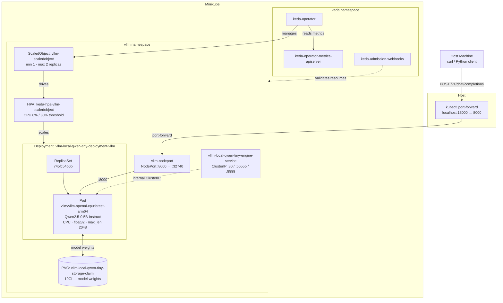

# vLLM on Minikube

A local vLLM inference stack on Kubernetes (Minikube), using the official
[vllm-project/production-stack](https://github.com/vllm-project/production-stack)
Helm chart. Serves `Qwen/Qwen2.5-0.5B-Instruct` via an OpenAI-compatible
`/v1/chat/completions` endpoint on CPU — no GPU required.

**Learning objective:** Validate the full vLLM-on-Kubernetes deployment architecture
so the only change when moving to a real GPU cluster is flipping `requestGPU: 0 → 1`.

---

## Prerequisites

Install the following on your host machine:

```bash
brew install minikube kubectl helm jq
```

- **Docker Desktop** — must be running with VM memory set to ≥14GB
  (Docker Desktop → Settings → Resources → Memory)
- **macOS Apple Silicon** — tested on M-series MacBook Pro

---

## Quick Start

```bash
# 1. Start Minikube (6 CPUs, 12GB RAM, 80GB disk)
./bootstrap-cluster.sh start

# 2. Install KEDA and add Helm repos
./bootstrap-cluster.sh deploy_infra

# 3. Deploy vLLM stack (first run downloads ~2GB model — takes 5–10 min)
./bootstrap-cluster.sh deploy_vllm

# 4. Send a smoke-test request
./bootstrap-cluster.sh test

# 5. Stop when done
./bootstrap-cluster.sh stop
```

---

## Bootstrap Commands

| Command | Description |
|---|---|
| `start` | Start Minikube with required resources; enable ingress and metrics-server addons |
| `deploy_infra` | Install KEDA via Helm; add kedacore and vllm Helm repos |
| `deploy_vllm` | Deploy vLLM production-stack via Helm; apply KEDA ScaledObject |
| `remove_vllm` | Uninstall vLLM Helm release and delete KEDA ScaledObject |
| `test` | Send a `/v1/chat/completions` request and print the JSON response |
| `stop` | Stop Minikube |

---

## Architecture



> **Note:** The LMCache router (`lmcache/lmstack-router`) has no ARM64 image manifest
> and is disabled (`routerSpec.enableRouter: false`). `helm/nodeport-service.yaml`
> provides a direct NodePort to the serving engine instead.

**Key resources in the `vllm` namespace:**

| Resource | Kind | Purpose |
|---|---|---|
| `vllm-local-qwen-tiny-deployment-vllm` | Deployment | vLLM serving engine (CPU, ARM64) |
| `vllm-nodeport` | Service (NodePort) | External access via port-forward |
| `vllm-local-qwen-tiny-engine-service` | Service (ClusterIP) | Internal cluster access |
| `vllm-local-qwen-tiny-storage-claim` | PVC (10Gi) | Model weight cache |
| `vllm-scaledobject` | ScaledObject (KEDA) | CPU-based autoscaling (max 2 replicas) |

---

## Configuration

Override values are in `helm/values-local.yaml`. Key settings:

| Setting | Value | Reason |
|---|---|---|
| `modelURL` | `Qwen/Qwen2.5-0.5B-Instruct` | Small model; fits in 8Gi CPU memory |
| `requestGPU` | `0` | CPU-only inference |
| `runtimeClassName` | `""` | Disables nvidia runtime |
| `dtype` | `float32` | float16 not supported on CPU |
| `extraArgs` | `--enforce-eager` | Disables CUDA graph capture for CPU |
| `maxModelLen` | `2048` | Reduces KV cache pressure on CPU |
| `pvcStorage` | `10Gi` | Persists weights; avoids re-download on restart |

---

## Performance Expectations

| Metric | Expected |
|---|---|
| First token latency | 30–120s |
| Throughput | ~1–3 tok/s |
| Cold start (no PVC) | 5–10 min |
| Warm start (PVC hit) | 2–4 min |

These are CPU inference numbers — irrelevant to the learning objective.
A valid JSON response from `/v1/chat/completions` is the success criterion.

---

## Test Guide

### 1. Start the cluster

```bash
./bootstrap-cluster.sh start
```

Expected output ends with:
```
[INFO] Cluster ready in Xs
```

Verify Minikube and addons are up:

```bash
minikube status
kubectl get pods -n ingress-nginx
kubectl get pods -n kube-system | grep metrics-server
```

---

### 2. Deploy infrastructure (KEDA)

```bash
./bootstrap-cluster.sh deploy_infra
```

Expected output ends with:
```
[INFO] ✅ keda-operator is ready!
[INFO] Infrastructure deployed in Xs
```

Verify KEDA is running:

```bash
kubectl get pods -n keda
```

All pods should show `Running`.

---

### 3. Deploy the vLLM stack

```bash
./bootstrap-cluster.sh deploy_vllm
```

This pulls `vllm/vllm-openai-cpu:latest-arm64` (~2.5GB) and downloads the model weights
into the PVC on first run. Allow up to 15 minutes.

Expected output ends with:
```
[INFO] ✅ vllm-serving-engine is ready!
[INFO] vLLM stack deployed in Xs
```

Verify the pod and KEDA ScaledObject:

```bash
kubectl get pods -n vllm
kubectl describe scaledobject vllm-scaledobject -n vllm | grep -E "Type|Reason|Message"
```

The pod should show `Running 1/1`. The ScaledObject should show `ScaledObjectReady`.

---

### 4. Send a test request

```bash
./bootstrap-cluster.sh test
```

Expected: a JSON response from the model, for example:

```json
{
  "id": "chatcmpl-...",
  "object": "chat.completion",
  "model": "Qwen/Qwen2.5-0.5B-Instruct",
  "choices": [
    {
      "message": {
        "role": "assistant",
        "content": "Hello! It's an honour to meet you..."
      },
      "finish_reason": "stop"
    }
  ],
  "usage": {
    "prompt_tokens": 35,
    "completion_tokens": 21,
    "total_tokens": 56
  }
}
```

Key things to check:
- `finish_reason` is `"stop"` (not `"length"` or `null`)
- `content` is a non-empty string
- `usage.completion_tokens` is greater than 0

You can also send a request manually:

```bash
kubectl port-forward svc/vllm-nodeport 18000:8000 -n vllm &
curl -s http://localhost:18000/v1/chat/completions \
  -H "Content-Type: application/json" \
  -d '{
    "model": "Qwen/Qwen2.5-0.5B-Instruct",
    "messages": [{"role": "user", "content": "What is Kubernetes in one sentence?"}],
    "max_tokens": 60
  }' | jq .
kill %1
```

---

### 5. Stop the cluster

```bash
./bootstrap-cluster.sh stop
```

Expected output:
```
[INFO] Minikube stopped.
```

The PVC (`vllm-local-qwen-tiny-storage-claim`) is preserved by Helm's
`resource-policy: keep` annotation — model weights are not re-downloaded on the
next `deploy_vllm`.

---

## Iterating on Configuration

To change `values-local.yaml` and redeploy without reinstalling KEDA:

```bash
./bootstrap-cluster.sh remove_vllm
# edit helm/values-local.yaml
./bootstrap-cluster.sh deploy_vllm
./bootstrap-cluster.sh test
```

---

## GPU Upgrade Path

To move this deployment to a real GPU cluster, make three changes in `helm/values-local.yaml`:

```yaml
# Remove or comment out:
runtimeClassName: ""          # → remove to use cluster default (nvidia)

# In modelSpec:
requestGPU: 1                 # was: 0

# Remove from vllmConfig:
dtype: "float32"              # → remove (use default bfloat16)

# Remove from extraArgs:
- "--enforce-eager"           # → remove (CUDA graphs improve GPU throughput)
```

Everything else — Helm chart, service exposure, KEDA autoscaling, ingress — is
production-equivalent and transfers without changes.

---

## Troubleshooting

| Symptom | Fix |
|---|---|
| Pod OOMKilled | Reduce `maxModelLen` or lower `--gpu-memory-utilization` in `extraArgs` |
| `Failed to infer device type` | Use `vllm/vllm-openai-cpu:latest-arm64` — the standard image is CUDA-only |
| `unrecognized arguments: --device cpu` | Remove `--device cpu` — the CPU image doesn't need it |
| `Available memory … less than desired utilization` | Lower `--gpu-memory-utilization` (default 0.92 requires ~12 GiB free) |
| `float16` dtype error | Confirm `dtype: "float32"` is set in `vllmConfig` |
| CUDA graph error | Confirm `--enforce-eager` is in `extraArgs` |
| KEDA ScaledObject pending | Ensure `deploy_infra` ran before `deploy_vllm` |
| Slow first response | Normal — CPU cold start; subsequent requests are faster |
